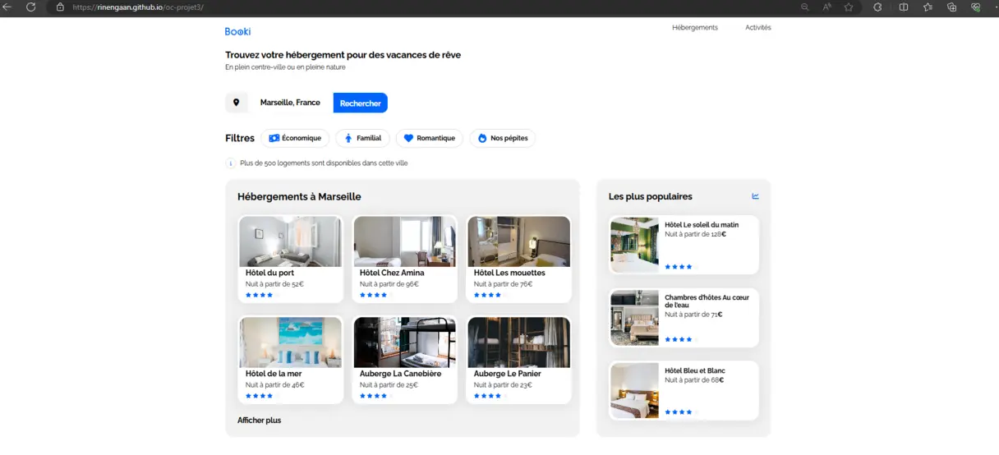

# booki

# Mission
Dans ce projet, vous créerez la page d'accueil d'une agence de voyage en utilisant HTML et CSS. 

Votre mission principale sera d'intégrer l'interface responsive de leur site. Vous aurez à disposition les maquettes Figma pour mobile, tablette et desktop, ainsi que les images et une note de synthèse sur les spécificités du projet.

Vous serez amenez à créer vos propres composants d'interface avec HTML et CSS afin d'avoir un rendu correspondant à la maquette

Cela vous donnera une compréhension plus profonde de la manière dont le code est structuré et stylisé pour répondre aux exigences de design.

# Compétences
En travaillant sur ce projet, vous développerez des compétences essentielles en design responsive, assurant que la page d'accueil fonctionne bien sur tous les appareils et tailles d'écran.

Implémenter une interface responsive avec HTML et CSS
Installer un environnement de développement front-end
Intégrer du contenu conformément à une maquette avec HTML et CSS